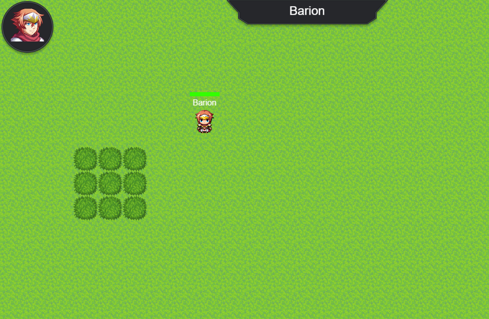

## Pixi.js Game

### About the project

This project has been built with Pixi.js, RPG Maker assets, Tilled, Rollup and Vanilla JavaScript.

### Instructions to run the game

How to run the app:

1. Clone the project
1. Install the dependencies with npm or yarn (`npm install` || `yarn`)
1. Run the project (`npm start` || `yarn start`)
